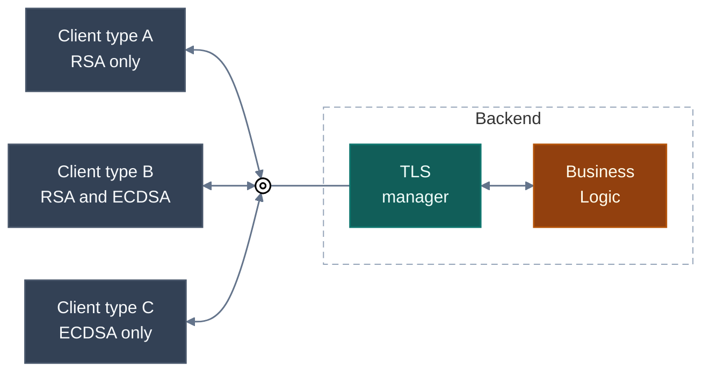
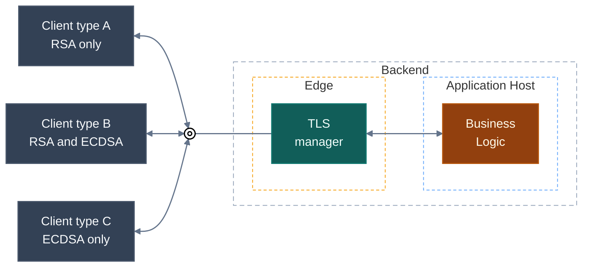
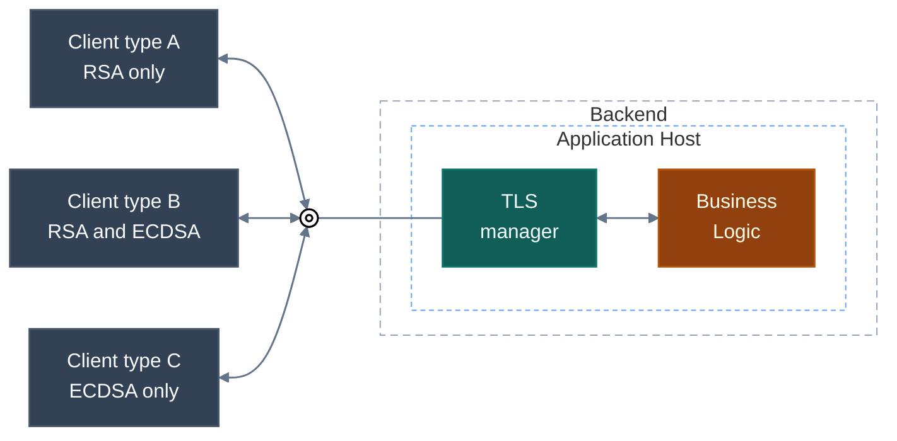

Most web servers are built for clients whose security behavior is handled by mainstream general-purpose operating systems.<br>
In that world, TLS handling by the web server is usually straightforward: one server name, one endpoint, one certificate chain, and broad interoperability across the signature schemes those stacks support.

The situation is different when clients fall outside that mainstream.<br>
In IoT, device fleets, industrial gateways, legacy SDKs, or application-to-application integrations, clients often have hard restrictions on which server authentication algorithms, certificate public key types, and certificate signature schemes they can use.

One important subset of those cases is about signature algorithms the client supports.<br>
Over time signature algorithms has evolved in this order RSA, DSA, ECDSA, RSA-PSS, Ed25519.
Due to the nature not all clients may support all of them, some clients may support only RSA; another may support only ECDSA; a third may support both.
This article focuses on exactly that situation.

When it comes to implementation of web serevr that can serve all this clients
That creates a specific requirement for the server: during the TLS handshake, it must inspect the client's capabilities and present a certificate with signature scheme that the client supports.

This article is about how to handle that requirement directly in ASP.NET Core Kestrel, without moving certificate management into a reverse proxy, external gateway, or other edge tier.

> Note: ASP.NET implementation, and most of the information available on this topic, focus on SNI-based certificate selection, where different server names map to different certificates, which is not the case here.<br>
Because of that, LLM-based AI assistants conclude that this scenario is impossible to implement in ASP.NET Core Kestrel.

> Note: The reader should have a deep understanding of TLS, especially the negotiation phase of the handshake.

### Visualization

The visualization below illustrates the exact case addressed in this article.<br>
The backend exposes one endpoint and clients have different capabilities.



## The Common Approach

This case is not unique and occurs frequently in some areas.<br>
It is often addressed by offloading TLS certificate management to a dedicated edge service placed in front of the web server.<br>
More specifically, that edge service is often a reverse proxy such as NGINX or HAProxy, or a managed edge gateway such as Azure Application Gateway, or Kubernetes Gateway API.

While this approach certainly works, it also brings significant drawbacks, such as:
- one more network hop,
- one more system to provision,
- one more availability domain,
- one more place where TLS configuration can drift,
- one more operational surface that costs money and must be managed.

In mutual TLS scenarios, this is even less attractive.<br>
Once certificate negotiation and identity extraction move to an edge service, authentication logic gets split across services.
The edge service now owns part of the security model, while the application owns another part.
Especially problematic in regulated or protocol-driven environments that require strict end-to-end client authentication and certificate binding at the application layer.<br>

### Visualization



## The Optimal Approach

For this specific case, the cleanest design is to keep certificate selection inside the application host.

That produces a much cleaner model:

- There is no extra hop and no extra failure point.
- TLS management stays with the host that actually owns the endpoint.
- Certificate selection is implemented exactly where the handshake happens.
- Mutual TLS (mTLS)-related logic can stay in one place.

### Visualization



## How Server-side Certificate Selection Works

Before moving forward, it is important to clarify how server-side certificate selection works.

This process must occur during the initial phase of the TLS handshake: after the client sends [ClientHello][rfc_8446_clienthello] and before the server responds with [ServerHello][rfc_8446_serverhello].

The server-side flow is as follows:

1. Receive the incoming TLS record.
2. Parse the record as [TLSPlaintext][rfc_8446_tlsplaintext] and verify that it contains a [Handshake][rfc_8446_handshake] message with a [ClientHello][rfc_8446_clienthello] body.
3. Extract the client capabilities relevant to certificate selection from ClientHello.
4. Select the appropriate certificate based on those capabilities and your server’s selection policy.
5. Respond with [ServerHello][rfc_8446_serverhello] and continue handshake, including Certificate message.

### How to get client capabilities

To determine which certificates are compatible, the [ClientHello][rfc_8446_clienthello] message must be inspected.

The exact location of the information needed for certificate selection depends on the TLS version:

| Version | Primary Source | Secondary Source
|:-------:|----------------|----------
| 1.2     | `signature_algorithms` extension | `cipher_suites` field
| 1.3     | `signature_algorithms_cert` extension | `signature_algorithms` extension

### How to choose which certificate to present

The actual certificate to present is chosen by considering both the client’s capabilities and the web server’s certificate selection policy.

The specific selection policy is determined by the server implementation and may depend on organizational requirements or security policies.

Typical strategies include:
- Prefer the certificate with the strongest algorithm supported by both server and client.
- Present a default certificate if it matches the client’s capabilities.
- If no compatible certificate is available, abort the handshake.

This is the core mechanism for dynamic certificate selection based on client capabilities.

## Implement using ASP.NET Core and Kestrel

Since ASP.NET Core 2.1, Kestrel provides the ability to configure TLS handshake behavior via [`HttpsConnectionAdapterOptions`][ms_learn_HttpsConnectionAdapterOption].

The `HttpsConnectionAdapterOptions` provides a [`ServerCertificateSelector`][ms_learn_HttpsConnectionAdapterOptions_ServerCertificateSelector] property that allows configuration of a callback that is called during the TLS negotiation phase.

> Historically, this API was designed for SNI-based certificate selection, where the server name influences which certificate is returned.<br>
However, nothing prevents using a different certificate-selection logic, such as client capabilities provided in `ClientHello` and implementation-specific policies.

The method assigned to `ServerCertificateSelector` accepts an argument of type [`ConnectionContext`][ms_learn_ConnectionContext].

The [`ConnectionContext`][ms_learn_ConnectionContext] implements the [`IMemoryPoolFeature`][ms_learn_IMemoryPoolFeature] interface, which exposes a [`MemoryPool`][ms_learn_IMemoryPoolFeature_MemoryPool] property.

The `MemoryPool` property can be used to access the raw TLS records as bytes sent by the client during the handshake. The relevant TLS record is a `TLSPlaintext` struct that carries a `Handshake` message with a `ClientHello` body. This enables custom parsing of handshake data if needed.

Starting with ASP.NET Core 10.0, `HttpsConnectionAdapterOptions` also provides the [`TlsClientHelloBytesCallback`][ms_learn_HttpsConnectionAdapterOptions_ClientHelloBytesCallback] property.<br>
This callback enables inspection of the incoming `ClientHello` before the certificate selection callback is invoked.

These APIs provide all the necessary hooks to implement dynamic certificate selection in Kestrel based on client capabilities, not just SNI.

## Demo

The implementation pattern is straightforward:

1. Register `TlsClientHelloBytesCallback`.
2. Parse the TLS record into a compact internal representation such as `RSA`, `ECDSA`, or both.
3. Store the parsed value in `ConnectionContext.Items`.
4. Register `ServerCertificateSelector`.
5. Read the parsed value and return the matching certificate.

In the demo, the HTTPS setup looks like this:

```csharp
void ConfigureHttpsOptions(HttpsConnectionAdapterOptions httpsOptions)
{
    httpsOptions.TlsClientHelloBytesCallback = OnTlsClientHelloBytes;
    httpsOptions.ServerCertificateSelector = SelectCertificate;
}
```

The callback parses the raw handshake message and stores the result on the connection:

```csharp
private static void OnTlsClientHelloBytes(ConnectionContext connectionContext, ReadOnlySequence<byte> data)
{
    var parseResult = TlsClientHelloParser.TryParse(data, out var signatureAlgorithms);

    if (parseResult == TlsClientHelloParseErrorCode.None)
    {
        connectionContext.Items["SignatureAlgorithms"] = signatureAlgorithms;
    }
}
```

The selector then chooses the certificate:

```csharp
private X509Certificate2? SelectCertificate(ConnectionContext? context, string? _)
{
    if (context is null)
    {
        return null;
    }

    if (!context.Items.TryGetValue("SignatureAlgorithms", out var value))
    {
        return null;
    }

    if (value is not TlsSignatureAlgorithms signatureAlgorithms)
    {
        return null;
    }

    if (signatureAlgorithms.HasFlag(TlsSignatureAlgorithms.ECDSA))
    {
        return certificateECDsa;
    }

    if (signatureAlgorithms.HasFlag(TlsSignatureAlgorithms.RSA))
    {
        return certificateRSA;
    }

    return null;
}
```

This is enough to support a single endpoint that can present either certificate depending on client capabilities.

The full demo, including the parser and integration tests, is available here:

- [GitHub repository][demo-repo]

The repository demonstrates:

- parsing raw `ClientHello` bytes,
- selecting RSA vs ECDSA certificates in Kestrel,
- validating behavior with integration tests,
- handling both TLS 1.2 and TLS 1.3 negotiation paths.

If you need this capability in a real system, the interesting part is not the amount of code, but that the mechanism is much closer to the server than many teams assume.

Kestrel is already in the handshake path. With the right callback, certificate selection is just another transport decision.

## Final Point

If you have one logical endpoint and heterogeneous non-browser clients, deploying an extra TLS tier should not be your default response.

When the requirement is simply:

- same host,
- same application,
- different certificate algorithms per client capability,

ASP.NET Core can solve it where the problem actually lives: inside the server during TLS negotiation.

---

If you found this article useful, feel free to buy the author [a cup of coffee](https://ko-fi.com/stas_sultanov) ☕.

----

[demo-repo]: https://github.com/stas-sultanov/asp-net-multicert
[rfc_8446]: https://www.rfc-editor.org/rfc/rfc8446
[rfc_8446_handshake]: https://www.rfc-editor.org/rfc/rfc8446#section-4
[rfc_8446_clienthello]: https://www.rfc-editor.org/rfc/rfc8446#section-4.1.2
[rfc_8446_tlsplaintext]: https://www.rfc-editor.org/rfc/rfc8446#section-5.1
[rfc_8446_serverhello]: https://www.rfc-editor.org/rfc/rfc8446#section-4.1.3
[rfc_8446_extensions]: https://www.rfc-editor.org/rfc/rfc8446#section-4.2
[rfc_8446_signature_scheme_list]: https://www.rfc-editor.org/rfc/rfc8446#section-4.2.3
[ms_learn_HttpsConnectionAdapterOption]: https://learn.microsoft.com/dotnet/api/microsoft.aspnetcore.server.kestrel.https.httpsconnectionadapteroptions
[ms_learn_HttpsConnectionAdapterOptions_ServerCertificateSelector]: https://learn.microsoft.com/dotnet/api/microsoft.aspnetcore.server.kestrel.https.httpsconnectionadapteroptions.servercertificateselector
[ms_learn_HttpsConnectionAdapterOptions_ClientHelloBytesCallback]: https://learn.microsoft.com/en-us/dotnet/api/microsoft.aspnetcore.server.kestrel.https.httpsconnectionadapteroptions.tlsclienthellobytescallback
[ms_learn_ConnectionContext]: https://learn.microsoft.com/dotnet/api/microsoft.aspnetcore.connections.connectioncontext
[ms_learn_IMemoryPoolFeature]: https://learn.microsoft.com/dotnet/api/microsoft.aspnetcore.connections.features.imemorypoolfeature
[ms_learn_IMemoryPoolFeature_MemoryPool]: https://learn.microsoft.com/dotnet/api/microsoft.aspnetcore.connections.features.imemorypoolfeature.memorypool
[ms-learn-X509Certificate2]: https://learn.microsoft.com/dotnet/api/system.security.cryptography.x509certificates.x509certificate2
